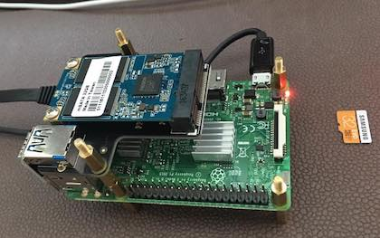
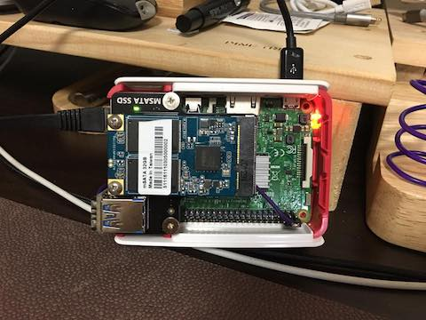
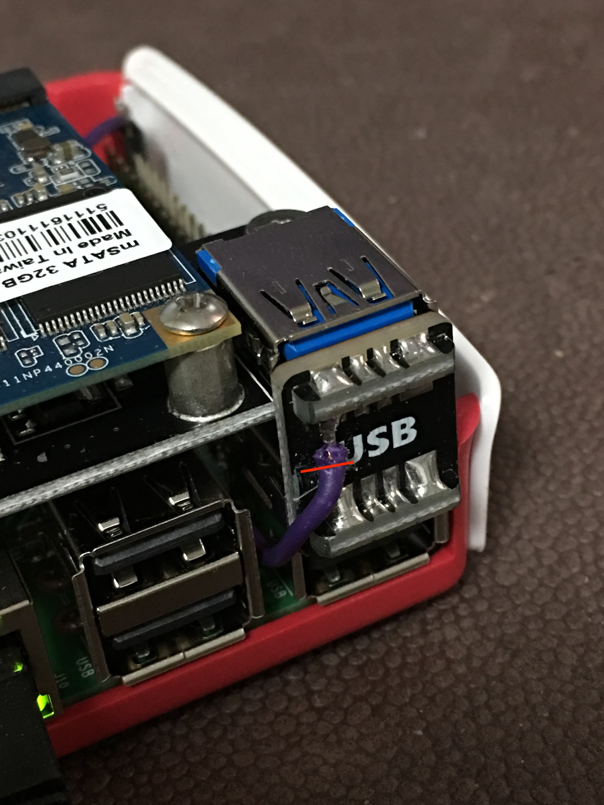
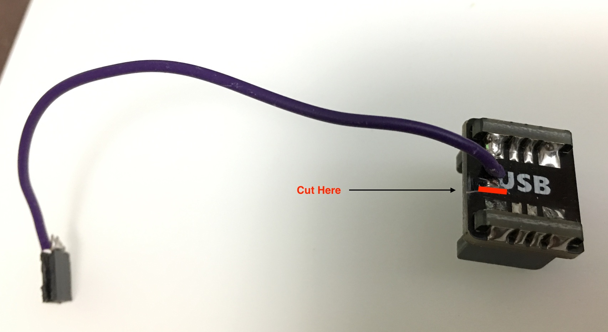

how to boot from a usb mass storage device on a rpi3
====================================================

#### ref 
* https://www.raspberrypi.org/documentation/hardware/raspberrypi/bootmodes/msd.md

```
echo program_usb_boot_mode=1 | sudo tee -a /boot/config.txt
```


#### problem : need power cycle
- https://www.raspberrypi.org/blog/pi-3-booting-part-i-usb-mass-storage-boot/#comment-1269851
- https://www.amazon.com/gp/product/B073CHHFMP Q&A


#### what to do
- use 5V gpio to supply power





